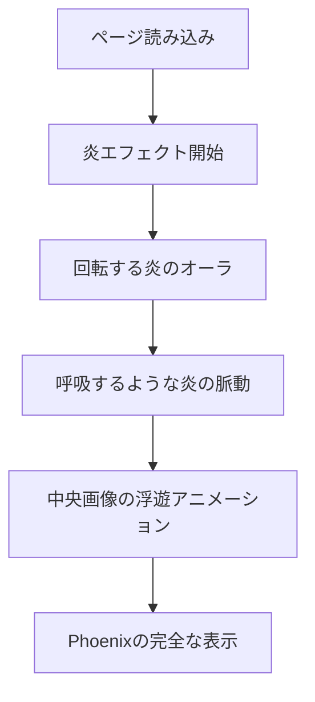

# デザイン文書

## 概要

闘魂Elixirコミュニティのランディングページを、GitHub Pagesで公開可能な形で強化・改善します。現在の優れたベースデザインを活かしながら、炎から火の鳥Phoenixへの昇華というコンセプトを視覚的に表現し、コミュニティの魅力を最大限に伝える印象的なサイトを構築します。

## アーキテクチャ

### 技術スタック
- **フロントエンド**: HTML5, CSS3, Vanilla JavaScript
- **ホスティング**: GitHub Pages
- **ビルドシステム**: GitHub Actions
- **アセット最適化**: 画像形式の最適化（WebP対応）
- **スタイリング**: CSS Custom Properties + モダンCSS機能

### ファイル構造
```
/
├── index.html              # メインページ
├── assets/                 # 画像・メディアアセット
│   ├── hero.png           # メインヒーロー画像
│   ├── hero.webp          # WebP版ヒーロー画像
│   ├── favicon.ico        # ファビコン
│   ├── favicon.png        # PNG版ファビコン
│   ├── ogp.png           # OGP画像
│   └── ogp.webp          # WebP版OGP画像
├── .github/
│   └── workflows/
│       └── deploy.yml     # GitHub Pages デプロイワークフロー
├── CNAME                  # カスタムドメイン設定
└── README.md             # プロジェクト説明
```

## コンポーネントとインターフェース

### 1. ヘッダーコンポーネント
- **ブランドロゴ**: SVGベースの炎をモチーフにしたロゴ
- **ナビゲーション**: GitHub、autoracex Events へのリンク
- **レスポンシブ対応**: モバイルでは簡潔な表示

### 2. ヒーローセクション
- **メインビジュアル**: 炎から火の鳥Phoenixへの昇華アニメーション
- **タイトル**: 「燃える闘魂で創る、Elixir時代のものづくり」
- **サブタイトル**: コミュニティの価値提案
- **CTA**: 参加方法への誘導

### 3. 炎・Phoenixアニメーションシステム


### 4. コンテンツセクション
- **About**: コミュニティの説明と目的・価値の明確な表示
- **Events**: autoracex connpassページ（https://autoracex.connpass.com/）へのリンク
- **Code of Conduct**: 行動規範

### 5. フッターコンポーネント
- **著作権情報**: 動的な年表示
- **リンク**: Credits、License

## データモデル

### サイト設定
```javascript
const siteConfig = {
  title: "闘魂Elixir — Official",
  description: "闘魂Elixir コミュニティの公式ランディングページ。闘魂とは己に打ち克つこと。そして闘いを通じて己の魂を磨いていくこと。",
  domain: "YOUR-CUSTOM-DOMAIN",
  ogImage: "/ogp.webp",
  themeColor: "#0b0b0b"
}
```

### カラーパレット
```css
:root {
  /* ベースカラー */
  --bg: #0b0b0b;
  --text: #e7e7e7;
  --muted: #b6b6b6;
  
  /* 炎のカラーグラデーション */
  --fire1: #ff5b2e;  /* 深い赤オレンジ */
  --fire2: #ff9a1f;  /* オレンジ */
  --fire3: #ffd166;  /* 黄金色 */
  --fire4: #ff3c7d;  /* マゼンタ */
  
  /* アクセント */
  --accent: #ff7a1a;
  --ring: #ffed9e33;
}
```

### アニメーション設定
```javascript
const animationConfig = {
  flame: {
    swirl: { duration: "22s", timing: "linear" },
    breathe: { duration: "5.4s", timing: "ease-in-out" }
  },
  hero: {
    float: { duration: "6s", timing: "ease-in-out" }
  },
  phoenix: {
    emergence: { duration: "3s", timing: "ease-out" }
  }
}
```

## エラーハンドリング

### 画像読み込みエラー
- **フォールバック**: SVGプレースホルダーの表示
- **プログレッシブ読み込み**: WebP → PNG → SVGの順で試行
- **エラー表示**: 適切なalt textとaria-labelの提供

### アニメーション制御
- **Reduced Motion対応**: `prefers-reduced-motion` メディアクエリでアニメーション無効化
- **パフォーマンス監視**: フレームレート低下時の自動調整
- **GPU加速**: `transform` と `opacity` を使用した最適化

### ネットワークエラー
- **オフライン対応**: 基本的なコンテンツの表示維持
- **遅延読み込み**: 重要でない画像の遅延読み込み

## テスト戦略

### 1. 視覚的回帰テスト
- **スクリーンショット比較**: 主要ブレークポイントでの表示確認
- **アニメーション検証**: 各段階での視覚的確認

### 2. パフォーマンステスト
- **Lighthouse監査**: パフォーマンス、アクセシビリティ、SEOスコア
- **Core Web Vitals**: LCP、FID、CLSの測定
- **画像最適化**: WebPサポートとファイルサイズ確認

### 3. アクセシビリティテスト
- **スクリーンリーダー**: NVDA、VoiceOverでの読み上げ確認
- **キーボードナビゲーション**: Tab順序とフォーカス管理
- **色彩コントラスト**: WCAG 2.1 AA準拠の確認

### 4. レスポンシブテスト
- **ブレークポイント**: 320px、768px、1024px、1440pxでの表示確認
- **デバイステスト**: iOS Safari、Android Chrome、デスクトップブラウザ

### 5. GitHub Pages統合テスト
- **デプロイメント**: プッシュ時の自動デプロイ確認
- **カスタムドメイン**: HTTPS接続とDNS設定の検証
- **OGP**: ソーシャルメディアでの表示確認

## パフォーマンス最適化

### 画像最適化
- **WebP対応**: モダンブラウザでのWebP配信
- **レスポンシブ画像**: `srcset` を使用した適切なサイズ配信
- **遅延読み込み**: `loading="lazy"` の活用

### CSS最適化
- **Critical CSS**: ファーストビューに必要なCSSのインライン化
- **CSS Custom Properties**: 効率的なテーマ管理
- **モダンCSS**: Grid、Flexbox、Clampの活用

### JavaScript最適化
- **Vanilla JS**: フレームワーク不使用による軽量化
- **イベント最適化**: パッシブリスナーとデバウンス処理
- **アニメーション最適化**: `requestAnimationFrame` の活用

### GitHub Pages最適化
- **静的アセット**: 適切なキャッシュヘッダー設定
- **圧縮**: Gzip圧縮の有効化
- **CDN活用**: GitHub Pagesの配信ネットワーク最適化